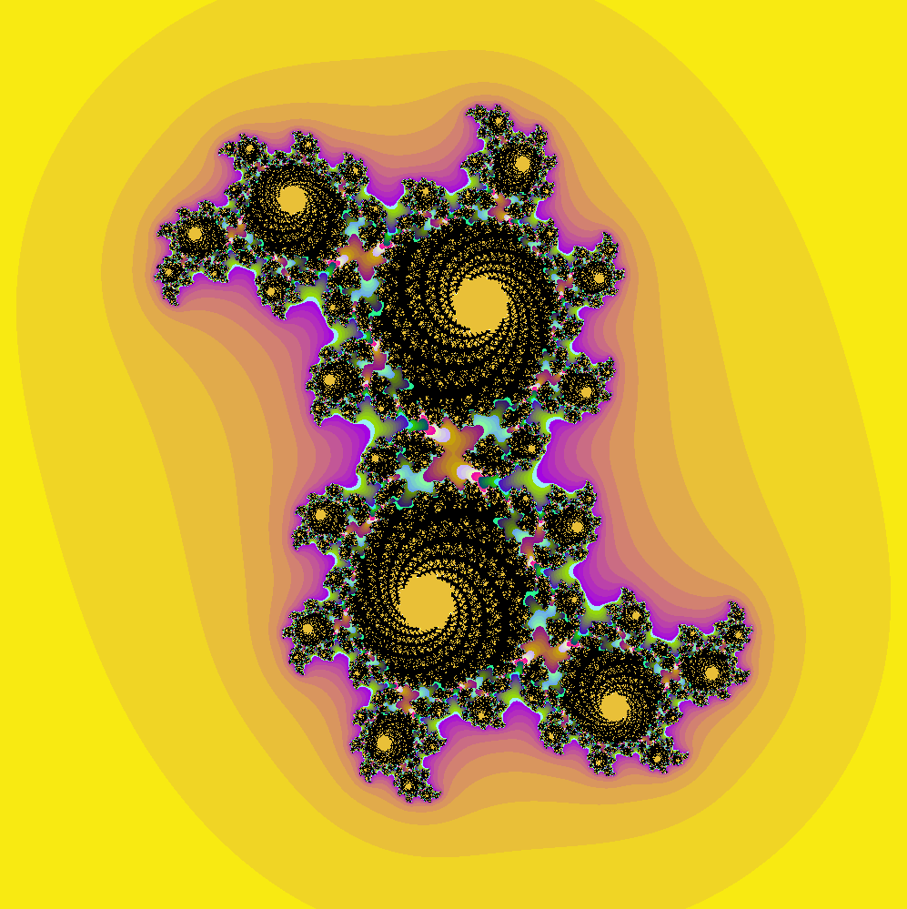

# 第二次作业要求

- 基于教材第四章**julia set**的例子，修改分形函数得到不同的图案，并利用计算结果给输出图案涂上渐变的彩色
## 实现效果


## 实现思路

- 借鉴了`HSL2RGB`颜色转换函数的写法，单纯使用`RGB`进行调色设定的颜色比较单一，过渡效果不好。
- 另外，通过`InitColorSet`函数获取`[0,MAX_COLOR]`区间内的色块颜色，设定渐变的范围为`[h2,h1]`之间，这样就有了色块的数据库，届时只需要通过`i%MAX_COLOR`，其中`i`是`julia`函数返回的经过迭代后跳出循环的迭代次数，依据该迭代次数，在数据库中找寻需要的色块。
```c
void InitColorSet(float h1 /* = 137.0 */, float h2 /* = 30.0 */, int* Pallette) {
    for (int i = 0; i < MAX_COLOR / 2; ++i) {
        HSL2RGB(h1, 20.0, i, Pallette + i * 3);
        HSL2RGB(h2, 30.0, i, Pallette + (MAX_COLOR - 1 - i) * 3);
    }
}
```
- 需要注意的是，`cudaMemcpy`和`cudaMalloc`函数中仅能对一维指针进行处理，曾经想开辟一个二维数组进行数据交换，但显然失败了。在数据库建立之后，将这个数据库送入`kernel`中进行计算即可。

