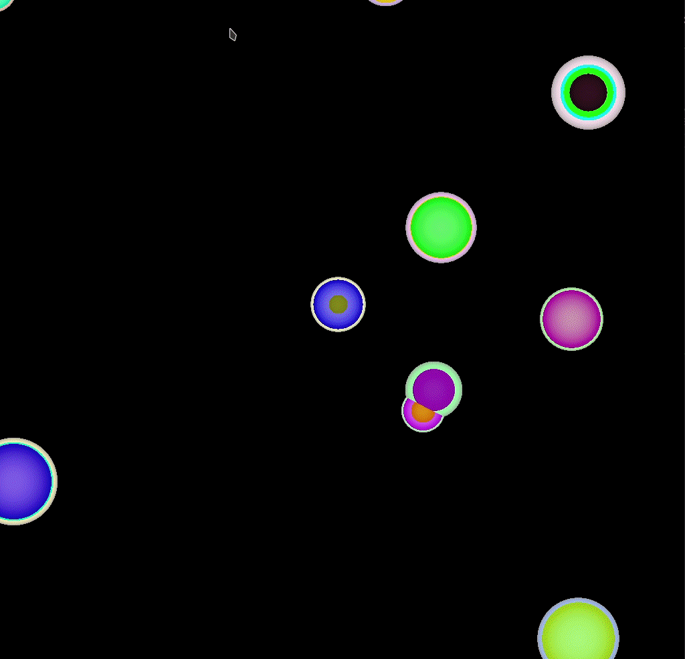

# 第三次作业要求
1. 实现动态场景的光线跟踪
2. 如何使用`constant memory/shared memory`？对比性能提升。
3. 尝试得到性能最优的`block/thread`配置参数。

## 实现效果



## 实现思路

### 1. 动态场景的光线跟踪
相较静态的场景主要对小球的位置、颜色、半径进行了动态的更新，并且通过chapter07中用的`bitmap.anim_and_exit()`方法更新图像的每一帧。

- **位置变更**：赋予每个小球一个随机的在xoy平面上的速度，z轴方向不存在速度，依据ticks对x和y两个方向的速度进行更新。为了保证小球在屏幕内运动，进行了边框检测，但不能对小球速度进行正负取反实现运动方向改变。这是由于小球位置是通过ticks这个线性增加的变量进行更新的，因而需要通过改变小球的显示方式实现。

- **颜色变更**：直接对颜色输出部分加上一个依据ticks不断增加的（和示例代码后乘255不同，先进行了乘255的扩大)，由于颜8位色域限制，因而需要对输出用255取模处理。

- **半径变更**：通过一个新的kernel在执行ray tracing的kernel开始前对当前帧的随机的几个圆球进行半径成比例扩大更新（限制了上下限）。如果写在Sphere结构体内更新半径，则由于每个线程所对应的是不同的图像像素点，而导致同属于一个圆的这些像素点会获取到不同的圆半径，这样圆会产生破碎感。

### 2. 使用 constant memory
|内存类型|小球数量|平均帧处理时间|内存类型|小球数量|平均帧处理时间|
|:-:|:-:|:-:|:-:|:-:|:-:|
|_global_|10|115.0 ms|_const_|10|115.8 ms|
|_global_|20|204.9 ms|_const_|20|206.4 ms|
|_global_|50|472.2 ms|_const_|50|477.8 ms|
|_global_|100|923.8 ms|_const_|100|926.9 ms|
|_global_|200|1825.7 ms|_const_|200|1839.1 ms|

测试了const和noconst，结果const反而不如noconst。且随着小球数量增多，两者之间的差距拉大。可能存在以下几个因素：
- half-warp处理但读取的地址不同。如果每个线程读取的内存地址都一致，则half-warp机制能够让速度提升至原来的16倍，但如果每个线程读取的内存地址都不相同，那么读取过程将会序列化，则速度降为原来的1/16。
- GPU算力不足。GeForce MX150只有384个核心，计算10个小球已经产生卡顿，相较内存读取的速度上的差异，算力不足带来的效率问题反而更严峻。另一个同学用6k多核，使用const内存计算2000个小球每帧仅3ms左右。

### 3. 尝试得到性能最优的`block/thread`配置参数。
按照NVIDIA GPU的warp机制的设计，应当将threads的数量设置为warp的整数倍最为妥当，查阅GeForce MX150的设备属性，一个warp大小为32，在我的测试中，threads大小设置为32时程序速度最快，设置为64以及更大数量时，无法输出图像。所以blocks数量为1024/32=32,threads数量为32。


## 运行测试
```shell
cd cuda-course-2022/A2
mkdir build
cmake -DCMAKE_BUILD_TYPE=Release -B build -S .
cmake --build build
./build/dynamic_ray_tracer # run program
```