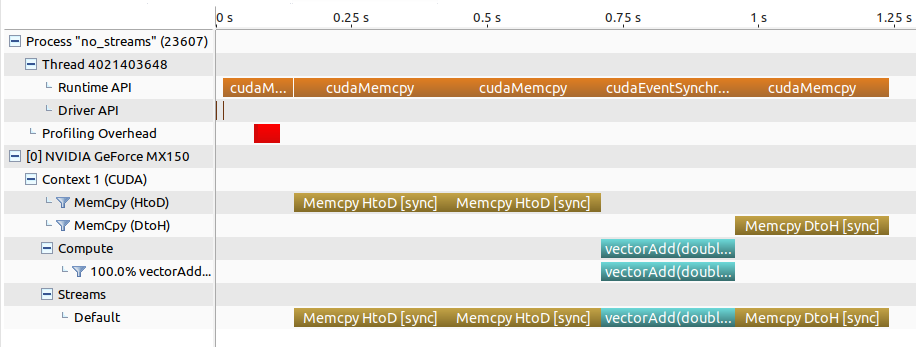
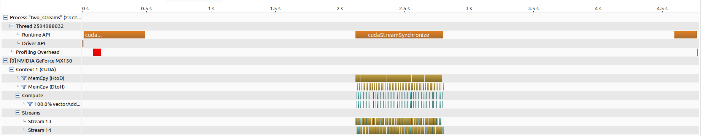
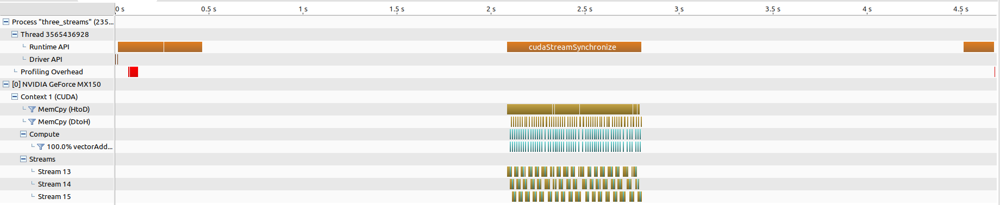

# 第四次作业要求

1. 内容：实现基于流的计算加速：如何使用stream/pinned memory实现计算和内存传输的overlap，对比性能提升。

2. 细节：基于我提供的`vectorAdd.cu`进行修改，对比不使用stream，两个stream，三个stream的加速效果。

3. 参考：`cuda by example`第十章的内容和例子，对比下书中两种使用两个stream的方法对于性能的影响。

4. 工具：visual profiler，分析stream的加速原因。

## 实现方案
通过使用 stream 以及 pinned memory实现加速。实验中改变处理数据量以比较不同方案之间的差异，并保持threads数量以及blocks数量一致。结合NVIDIA Visual Profiler对不同方案的执行流程以及细节进行分析。


## 结果分析

### vectorAdd 对比分析
#### [no stream]
```shell
[Vector addition of 6291456 elements]
CUDA kernel launch with 6144 blocks of 1024 threads
GPU Time used:  111.1 ms
```

```shell
[Vector addition of 56623104 elements]
CUDA kernel launch with 55296 blocks of 1024 threads
GPU Time used:  800.3 ms
```


#### [two stream]
```shell
[Vector addition of 6291456 elements]
CUDA kernel launch with 1024 blocks of 1024 threads
GPU Time used:  89.2 ms
```
```shell
[Vector addition of 56623104 elements]
CUDA kernel launch with 1024 blocks of 1024 threads
GPU Time used:  642.0 ms
```


#### [three stream]
```shell
[Vector addition of 6291456 elements]
CUDA kernel launch with 1024 blocks of 1024 threads
GPU Time used:  87.5 ms
```
```shell
[Vector addition of 56623104 elements]
CUDA kernel launch with 1024 blocks of 1024 threads
GPU Time used:  681.5 ms
```


- 从上述结果可以看出，stream处理能够实现数据的分组overlap处理，在不同的stream上可以同时处理不同的数据，依此实现并行加速。
- 数据量为 **6291456** 时，三种处理模式耗时对比 `no_stream(111.1 ms) > two_streams(89.2 ms) > three_streams(87.5 ms)`，但是数据量为 **56623104** 时，三种处理模式耗时对比 `no_stream(800.3 ms) > three_streams(681.5 ms) > two_streams(642.0 ms)`，出现了直觉之外的结果，分析如下：
  - 一般来说stream数量越多，加速效果越好，但数据拷贝时存在最大数据吞吐量，在我的实验中，`Throughput`这个指标在stream的数量大于等于2时，其值为[0.7GiB/s,1.5GiB/s]之间，且stream数量越大，最小吞吐量的短板效应越显著，因而测试中发现stream数量多于2时反而效果变差了。


### chapter10 例子对比
两种使用`stream`的方法并不存在较大差异。
#### [basic_double_stream]
```shell
./basic_double_stream
Time taken:  113.2 ms
```
#### [basic_double_stream_correct]
```shell
./basic_double_stream_correct
Time taken:  114.2 ms
```