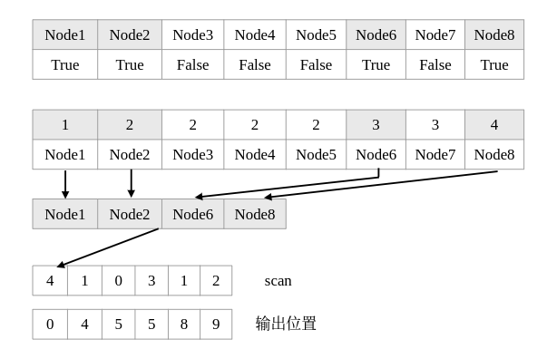

# 第五次的作业
1. 解读课上并行scan算法，给出其原理，证明正确性；
2. 对于碰撞检测场景，如果每个线程检测出来的碰撞结果个数完全随机，如何实现结果收集（连续保存在一个大小为M的数组，M为总的碰撞个数）？


### 1.1 并行scan算法解读

**scan** 算法的计算伪代码为
```c++
for j:=1 to log2n do
    for all k in parallel do
        if k >= 2^j then
            x[k]:=x[k-2^(j-1)] + x[k]
        fi
    od
od 
```
其中 $j$ 表示迭代计算的次数，每次计算时检查当前数据的索引值 $k$ 与 $2^{(j-1)}$ 进行比较，若有 $ k \ge 2^{(j-1)} $，则当前下标为 $k$ 的数据与 $ k - 2^{(j-1)} $相加作为 $j+1$ 轮下标为 $k$ 处的数据，若条件不成立，$j+1$ 轮下标为 $k$ 处的数据与 $j$ 轮数据一致。直至 $j$ 的值与 $\lfloor log_{2}n\rfloor$ 的值一致，即 $ 2^{j-1} < n \le 2^{j}$，运算结束。最终的值与串行计算结果一致，$k$ 处结果为 $\sum_{i=0}^{k}x_{i}$。

上述计算实现了层序分离，使得每一轮的计算能够利用到 $n - 2^{j}$ 数量的线程，相较串行办法，总的加法计算复杂度为 $O(nlogn)$,每一步的计算复杂度为 $O(logn)$。


### 1.2 Hillis Steele Algorithm 证明

根据Hillis Steele算法原理，有如下关系成立：对于一个$k$维的并行计算数据，记$x_{n}$为第$n$个数，$j$表示第$j$次运算，那么有
$$
\begin{cases}
x_{n}^{[j]}=x_{n-2^{j-1}}^{[j-1]}+x_{n}^{[j-1]} &\text ,n > 2^{j-1} ,j \in [1,log_{2}k] \tag{1} \\
x_{n}^{[j]} = x_{n}^{[j-1]} &\text ,n \le 2^{j-1},j \in [1,log_{2}k] \\
\end{cases}
$$


不妨记区间 $[a,b]$ 之间的元素和为
$$
\sum\nolimits_{(a)}^{(b)}=\sum\nolimits_{i=a}^{b}{x_i},i \in [a,b]
$$

那么有如下等式必然成立
$$
\sum\nolimits_{(a)}^{(b)} + \sum\nolimits_{(b+1)}^{(c)} = \sum\nolimits_{(a)}^{(c)}
$$

设当前 $j_f$ 表示最后一次运算，结合式 $(1)$ 有如下关系
$$
n - 2^{j_{f} - 1} > 0 \\
n - 2^{j_{f}} \le 0 \\
$$

式 $(1)$ 中的上式可以表示为如下形式
$$
x_{n}^{[j_{f}]} = \sum\nolimits_{(0)}^{(n)} = \sum_{i=0}^{1} x^{[j-1]}_{n-i*2^{j-1}}
$$

#### 证明过程

根据式 $(1)$，向前 $x$ 步展开的结果应为
$$
x_{n}^{[j_{f}]} = \sum\nolimits_{(0)}^{(n)} = \sum_{i=0}^{2^{x} -1} x^{[j-x]}_{n-i*2^{j-x}} \tag{2}
$$

对式 $(2)$ 代入 式 $(1)$ 的上式，再向前展开一步，即向前展开到 $x+1$ 步，如下所示

$$
\begin{align*}
\sum_{i=0}^{2^{x} -1} x^{[j-x]}_{n-i*2^{j-x}} &= \sum_{i=0}^{2^{x} -1}  x^{[j-x-1]}_{n-i*2^{j-x} - 2^{j-x-1}} +  x^{[j-x-1]}_{n-i*2^{j-x} } \\
&= \sum_{i=0}^{2^{x} -1}  x^{[j-x-1]}_{n-(2i+1)*2^{j-x-1}} +  x^{[j-x-1]}_{n-(2i)*2^{j-x-1} } \\
&=   x^{[j-x-1]}_{n} + x^{[j-x-1]}_{n-2^{j-x-1}} + x^{[j-x-1]}_{n-2*2^{j-x-1}} + x^{[j-x-1]}_{n-3*2^{j-x-1}} + ... + x^{[j-x-1]}_{n-(2^{x+1}-2)*2^{j-x-1}} + x^{[j-x-1]}_{n-(2^{x+1}-1)*2^{j-x-1}} \\
&= \sum_{i=0}^{2^{x+1} -1} x^{[j-x-1]}_{n-i*2^{j-x-1}}\\
\end{align*} \tag{3}
$$

通过数学归纳法代入式 $(3)$ 递推公式，可以证明式 $(2)$ 为该公式的通项当， $x = j $ 时有
$$
\begin{align*}
x_{n}^{[j_{f}]} = \sum\nolimits_{(0)}^{(n)} &= \sum_{i=0}^{2^{j} -1} x^{[0]}_{n-i*2^{0}} \\
&= x_{n}^{[0]} + x_{n-1}^{[0]} + ... + x_{1}^{[0]}, j \in MAX(1,  \lfloor log_{2}{k} \rfloor) \tag{4}
\end{align*}
$$

证毕。

<div STYLE="page-break-after: always;"></div>

## 2. 碰撞检测结果存储


每个线程都去做碰撞检测，碰撞的节点记录碰撞结果 (True or False)，每个线程输出的时候时，在之前 scan 计算得到的 inclusive "cary"的基础上计算当前线程的 scan，对于存在碰撞的节点，scan_sum增加1，那么在这次扫描结束后，scan_sum发生改变节点就是需要存储的位置。计算的最终结果最后的inclusive "carry"的值作为下一个线程计算的偏移量。最终有M个碰撞点被检测到，最后的"carry"值也是M。